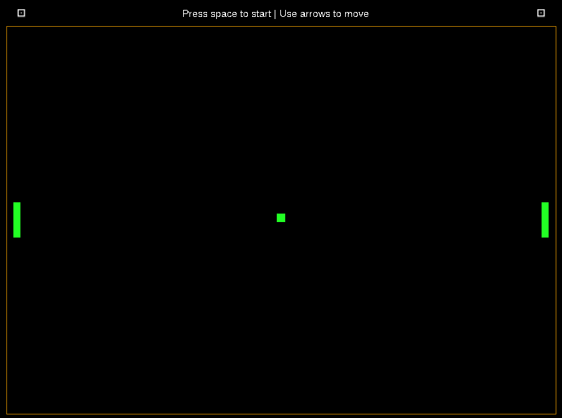

# Pong

Standalone builds available in releases section.

Requirements to generate build files:
1) Git
2) Cmake

Sample commands for cmake:

1. git clone https://github.com/Faizan1015/Pong.git
2. mkdir Pong/build
3. cd Pong/build
4. cmake .. -G "Your preferred generator"

